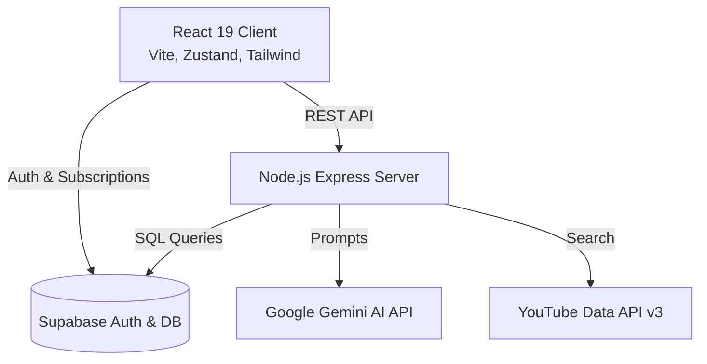

# 🚀 LearnHub AI

**Your personalized, AI-driven learning ecosystem.**

LearnHub AI is a full-stack platform designed to help self-directed learners discover curated topics, track their learning streaks, and receive weekly AI-generated insights on their progress.

Built with **React 19**, **Node.js/Express**, **Supabase**, and powered by **Google Gemini**.

---

## 📸 Overview

- **Explore:** Search for any topic and instantly receive AI-generated summaries, curated YouTube tutorials, and suggested certifications.
- **Vault:** Save, pin, and manage your AI-generated notes.
- **Pathways:** Save multi-tier learning roadmaps and track milestone progression.
- **Pulse Dashboard:** A dynamic GitHub-style streak calendar that tracks your daily learning habit.
- **AI Recaps:** A weekly AI-powered reflection summarizing your learning activity and suggesting next steps.

---

## 🏗️ Architecture



---

## 🛠️ Tech Stack

### Frontend
- **Framework:** React 19 + Vite
- **Routing:** React Router v7
- **State Management:** Zustand
- **Styling:** Vanilla CSS + Warm Flat 2.0 Design System
- **Animations:** Framer Motion
- **Icons:** Lucide React

### Backend
- **Framework:** Node.js + Express
- **Database:** PostgreSQL (via Supabase)
- **Authentication:** Supabase Auth (Email, Google, GitHub)
- **AI:** Google Gemini (1.5 Pro & 1.5 Flash)
- **Validation:** Zod

---

## 🚀 Getting Started (Local Development)

### 1. Prerequisites
- Node.js (v18+)
- A Supabase project
- A Google AI Studio API Key (for Gemini)
- A Google Cloud Console API Key (for YouTube Data API)

### 2. Setup the Database
Run the SQL migration files located in `supabase/migrations/` sequentially in your Supabase SQL Editor:
1. `v1.0_core_mvp.sql`
2. `v1.5_persistence.sql`
3. `v2.0_engagement.sql`
4. `v2.5_intelligence.sql`

### 3. Server Configuration
```bash
cd server
npm install
cp .env.example .env
```
Fill in the `.env` variables with your Supabase, Gemini, and YouTube credentials.
Start the server:
```bash
npm run dev
```

### 4. Client Configuration
```bash
cd client
npm install
cp .env.example .env
```
Fill in the `.env` variables with your Supabase project URL and Anon Key.
Start the client:
```bash
npm run dev
```
The app will run at `http://localhost:5173`.

---

## 🌍 Production Deployment Guide

LearnHub AI is production-ready. Follow these steps to deploy:

### 1. Frontend (Vercel)
The project includes a `client/vercel.json` configured for SPA routing.
1. Connect your GitHub repository to Vercel.
2. Set the Root Directory to `client`.
3. Add your `VITE_SUPABASE_URL`, `VITE_SUPABASE_ANON_KEY`, and `VITE_API_URL` (pointing to your deployed Render server).
4. Deploy.

### 2. Backend (Render)
The project includes a `server/render.yaml` blueprint.
1. Connect Render to your repository.
2. Select "Blueprint" and it will automatically provision the Node web service.
3. Manually inject your sensitive environment variables (Supabase secrets, Gemini API, YouTube API) in the Render dashboard.

### 3. Critical Production Configurations
- **OAuth Redirects:** In your Supabase Dashboard → Authentication → URL Configuration, add your new Vercel production URL (e.g., `https://learnhub-ai.vercel.app/auth/callback`) to the **Redirect URLs** list.
- **HTTPS & CORS:** The Express server automatically hardens CORS to only allow the domain specified in `FRONTEND_URL`. Ensure this perfectly matches your deployed Vercel domain to prevent Cross-Origin errors.

---

## ♿ Accessibility

LearnHub AI adheres to modern accessibility standards:
- **Keyboard Navigable:** Full focus trapping in modals and explicit `:focus-visible` rings.
- **Mobile-Ready:** Touch targets exceed 44px on mobile viewports.
- **Color Contrast:** The Warm Flat 2.0 palette exceeds WCAG 4.5:1 contrast ratios.
