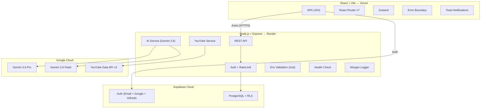
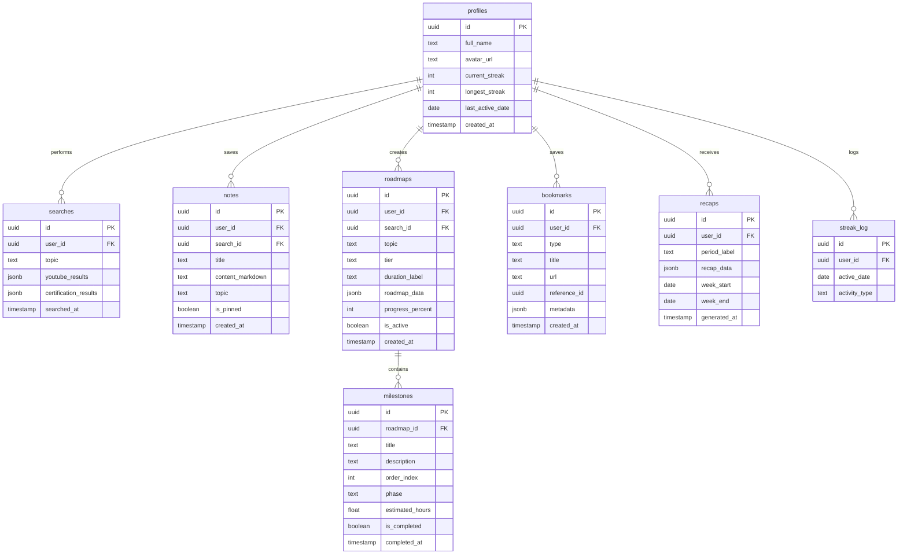

# LearnHub AI — Implementation Plan (v4 Final)

A modern, minimal full-stack learning platform that uses AI to generate personalized study notes, YouTube recommendations, certification suggestions, and adaptive roadmaps.

---

## 🎯 Core Philosophy

> **Modern yet Minimal.** Every feature earns its place. No bloat — a clean, focused learning companion powered by Gemini 3.6. UX stays simple — polish is invisible, never complex.

---

## 🧩 All 8 Features

| # | Feature | Key | Description |
|---|---|---|---|
| 1 | **Gateway** | `auth` | Login, Register, Logout + Google & GitHub OAuth |
| 2 | **Explore** | `ai-search` | AI topic search → Notes, Videos, Certifications, Roadmap |
| 3 | **Vault** | `notes` | Personal knowledge vault for AI-generated notes |
| 4 | **Pathways** | `roadmap` | Interactive tiered roadmaps (Sprint / Stride / Marathon) |
| 5 | **Pulse** | `progress` | Dashboard stats, progress rings, completion rates |
| 6 | **Bookmarks** | `bookmarks` | Save/pin videos, certs, or notes from anywhere |
| 7 | **Streaks** | `streaks` | Daily learning streak + visual contribution calendar |
| 8 | **Recap** | `recap` | Weekly AI summary on dashboard (no emails) |

---

## 🔒 Security Layer

| Measure | What It Does | Where |
|---|---|---|
| **Env Validation** | All env vars validated with **Zod** on server startup — crashes early with clear error if any key is missing or malformed | `server/src/config/env.js` |
| **API Key Protection** | Gemini & YouTube keys live **only** on the backend — frontend never sees them. All AI calls are proxied through Express API | Architecture-level |
| **HTTPS Enforcement** | All traffic encrypted — Vercel & Render enforce HTTPS by default. `Strict-Transport-Security` header set | Deployment-level |
| **Supabase RLS** | Row Level Security on every table — users can only read/write their own rows. Policies enforced at the database level | Supabase PostgreSQL |
| **Rate Limiting** | AI endpoints (`/api/explore`, `/api/recap`) rate-limited via `express-rate-limit` — prevents API abuse and cost overruns | `server/src/middleware/rateLimiter.js` |

### Env Validation Schema (Zod)

```js
// server/src/config/env.js
const envSchema = z.object({
  PORT:                     z.string().default('5000'),
  NODE_ENV:                 z.enum(['development', 'production']),
  SUPABASE_URL:             z.string().url(),
  SUPABASE_SERVICE_ROLE_KEY:z.string().min(1),
  GEMINI_API_KEY:           z.string().min(1),
  YOUTUBE_API_KEY:          z.string().min(1),
  CORS_ORIGIN:              z.string().url(),
});

// Validates on startup — crashes with clear message if invalid
export const env = envSchema.parse(process.env);
```

### Rate Limiter Config

```js
// AI endpoints: 10 requests per minute per user
// Auth endpoints: 5 requests per minute per IP
// General endpoints: 60 requests per minute per user
```

---

## ✨ UX Polish Layer

> **Rule: Polish is invisible.** Every addition makes the app feel smoother without adding visual complexity.

| Addition | Purpose | Complexity to User |
|---|---|---|
| **404 Page** | Friendly "page not found" with a button back to Dashboard | Zero — just a fallback |
| **Error Boundary** | If React crashes, shows "Something went wrong" + retry button instead of blank screen | Zero — only seen on errors |
| **Toast Notifications** | Subtle bottom-right popups: "Note saved ✓", "Bookmark added ✓", "Error, try again" | Minimal — auto-dismisses in 3s |
| **Skeleton Loaders** | Shimmer placeholders while AI generates results — no jarring spinners | Zero — replaces loading spinners |
| **Smooth Scroll** | `scroll-behavior: smooth` globally — buttery navigation | Zero — just feels better |
| **Favicon + Meta Tags** | Proper browser tab icon, `<title>`, `<meta description>`, Open Graph for link sharing | Zero — invisible infrastructure |
| **Empty States** | Clean message + subtle icon when Vault/Pathways/Bookmarks are empty: "No notes yet. Explore a topic to get started." | Minimal — guides the user |
| **Confirmation Modals** | Simple "Delete this note?" modal with Cancel/Delete — only on destructive actions | Minimal — prevents mistakes |

### Toast Setup

Using **`react-hot-toast`** — the most minimal toast library (2KB):

```jsx
// Triggered on actions:
toast.success('Note saved to Vault');
toast.success('Milestone completed');
toast.error('Something went wrong');
// Auto-dismisses, no user action needed
```

### Skeleton Pattern

```
┌─────────────────────────────────┐
│ ░░░░░░░░░░░░░░░░  (shimmer)    │  ← While AI is generating
│ ░░░░░░░░░░░░                   │
│ ░░░░░░░░░░░░░░░░░░░            │
└─────────────────────────────────┘
         ↓ fades into ↓
┌─────────────────────────────────┐
│ Understanding JSX               │  ← Actual content
│ JSX lets you write HTML-like    │
│ syntax inside JavaScript...     │
└─────────────────────────────────┘
```

---

## ♿ Accessibility Layer

> **Simple rule: If a sighted keyboard user can use the entire app without a mouse, accessibility is solid.**

| Practice | Implementation |
|---|---|
| **Semantic HTML** | `<main>`, `<nav>`, `<section>`, `<article>`, `<button>` — never `<div onClick>` |
| **Keyboard Navigation** | All interactive elements reachable via Tab, activated via Enter/Space |
| **ARIA Labels** | Icon-only buttons get `aria-label` (e.g., bookmark ⭐ → `aria-label="Bookmark this video"`) |
| **Focus Management** | Modals trap focus inside; on close, focus returns to the trigger button |
| **Color Contrast** | All text meets **4.5:1** ratio — verified against dark background tokens |
| **Focus Indicators** | Visible `outline` ring on focused elements (styled to match indigo accent) |

---

## 🧹 Code Quality Layer

| Addition | Purpose |
|---|---|
| **ESLint + Prettier** | Auto-format on save, catch bugs early — consistent code across the project |
| **Morgan** | HTTP request logging in Express — see every API call in terminal |
| **Health Check** | `GET /api/health` → `{ status: "ok", timestamp }` — Render uses this for uptime monitoring |
| **Standardized API Responses** | Every endpoint returns `{ success: true, data }` or `{ success: false, error }` |
| **`.env.example`** | Template listing all required env vars — essential for onboarding & portfolio |
| **`.gitignore`** | Excludes `node_modules/`, `.env`, `dist/`, IDE files |
| **`README.md`** | Setup instructions, architecture overview, env var list, screenshots |

### API Response Format

```js
// Success
{ success: true, data: { ... } }

// Error
{ success: false, error: { message: "Topic is required", code: "VALIDATION_ERROR" } }

// Every controller uses helper:
res.json(apiSuccess(data));
res.status(400).json(apiError("Topic is required", "VALIDATION_ERROR"));
```

---

## 🤖 AI Tool Matrix — Gemini 3.6

| Model | Use For |
|---|---|
| **Gemini 3.6 Pro** | Notes, Roadmaps, Certifications — highest quality |
| **Gemini 3.6 Flash** | Recap, Milestone expansion — fast & lightweight |

### AI Operation Map

| Operation | Model | Output | Temp |
|---|---|---|---|
| Generate Study Notes | Gemini 3.6 Pro | Markdown | 0.7 |
| Generate Roadmap (3 tiers) | Gemini 3.6 Pro | JSON (structured) | 0.3 |
| Suggest Certifications | Gemini 3.6 Pro | JSON array | 0.2 |
| Search Videos | YouTube Data API v3 | JSON | — |
| Expand Milestone | Gemini 3.6 Flash | JSON | 0.3 |
| Weekly Recap | Gemini 3.6 Flash | JSON | 0.5 |

All structured outputs use `responseMimeType: "application/json"` + `responseSchema`.

### Dev Tools (Building the App)

| Tool | Used For |
|---|---|
| **Claude Opus** (Antigravity) | Complex components, business logic, architecture |
| **Claude Sonnet** (Antigravity) | Quick edits, smaller components, bug fixes |
| **Supabase Stitch** | DB schema, RLS policies, SQL migrations |

---

## 🏗️ Architecture



---

## 🛠️ Tech Stack

### Frontend
| Tech | Purpose |
|---|---|
| React 19 + Vite 6 | SPA + build |
| React Router v7 | Routing |
| Zustand | State |
| CSS Modules + CSS Variables | Styling |
| Framer Motion | Animations |
| Lucide React | Icons |
| React Markdown + rehype-highlight | Note rendering |
| Axios | HTTP client |
| Recharts | Dashboard charts |
| date-fns | Date formatting |
| react-hot-toast | Toast notifications |

### Backend
| Tech | Purpose |
|---|---|
| Node.js 20+ / Express | API server |
| @google/generative-ai | Gemini 3.6 SDK |
| googleapis | YouTube Data v3 |
| @supabase/supabase-js | DB + Auth |
| Zod | Input + env validation |
| express-rate-limit | Rate limiting |
| morgan | Request logging |
| cors + dotenv | Config |

### Infrastructure
| Tech | Purpose |
|---|---|
| Supabase Auth | Email + Google + GitHub OAuth |
| Supabase PostgreSQL | Database with RLS |
| Vercel | Frontend hosting (HTTPS) |
| Render | Backend hosting (HTTPS) |

---

## 📁 Project Structure

```
LHAI/
├── client/
│   ├── public/
│   │   ├── favicon.svg
│   │   └── og-image.png                 # Open Graph preview image
│   ├── src/
│   │   ├── components/
│   │   │   ├── common/                  # Button, Input, Card, Modal, Loader,
│   │   │   │                            #   Badge, Skeleton, ConfirmModal,
│   │   │   │                            #   EmptyState, ErrorBoundary
│   │   │   ├── layout/                  # Navbar, Sidebar, PageWrapper, BottomBar
│   │   │   └── features/
│   │   │       ├── auth/                # LoginForm, RegisterForm, OAuthButtons
│   │   │       ├── explore/             # SearchBar, ResultsTabs, NotesTab,
│   │   │       │                        #   VideosTab, CertsTab, PathwayPreview
│   │   │       ├── vault/               # NoteCard, NoteViewer, NotesList
│   │   │       ├── pathways/            # RoadmapTimeline, MilestoneCard,
│   │   │       │                        #   TierSelector, ProgressRing
│   │   │       ├── pulse/               # StatsGrid, StreakCalendar,
│   │   │       │                        #   ProgressChart, RecapCard
│   │   │       └── bookmarks/           # BookmarkCard, BookmarksList,
│   │   │                                #   BookmarkFilters
│   │   ├── hooks/                       # useAuth, useExplore, useVault,
│   │   │                                #   usePathways, useBookmarks
│   │   ├── pages/                       # Landing, Login, Register, Dashboard,
│   │   │                                #   Explore, Vault, NoteView, Pathways,
│   │   │                                #   PathwayView, Bookmarks, Profile,
│   │   │                                #   NotFound
│   │   ├── services/                    # api.js, auth/explore/notes/roadmap/
│   │   │                                #   bookmark.service.js
│   │   ├── store/                       # authStore, exploreStore, uiStore
│   │   ├── styles/
│   │   │   ├── globals.css              # Reset, variables, smooth scroll
│   │   │   ├── theme.css                # Dark/light tokens
│   │   │   └── animations.css           # Keyframes
│   │   ├── utils/                       # constants, formatters, validators
│   │   ├── App.jsx                      # ErrorBoundary + Toaster + Routes
│   │   └── main.jsx
│   ├── index.html                       # Meta tags, OG tags, favicon
│   ├── .eslintrc.cjs
│   ├── .prettierrc
│   ├── vite.config.js
│   ├── .env.example
│   └── package.json
│
├── server/
│   ├── src/
│   │   ├── config/
│   │   │   ├── env.js                   # Zod env validation — crashes if invalid
│   │   │   ├── supabase.js
│   │   │   ├── gemini.js                # Gemini 3.6 Pro + Flash clients
│   │   │   └── youtube.js
│   │   ├── controllers/                 # auth, explore, notes, roadmap,
│   │   │                                #   bookmark, recap
│   │   ├── middleware/
│   │   │   ├── auth.middleware.js        # Verify Supabase JWT
│   │   │   ├── rateLimiter.js           # Per-endpoint rate configs
│   │   │   └── errorHandler.js          # Global catch-all error handler
│   │   ├── routes/                      # auth, explore, notes, roadmap,
│   │   │                                #   bookmark, recap, health
│   │   ├── services/                    # ai, youtube, roadmap, streak, recap
│   │   ├── prompts/                     # notes, roadmap, certification, recap
│   │   ├── schemas/                     # Zod schemas for Gemini responses
│   │   └── utils/
│   │       └── apiResponse.js           # apiSuccess() / apiError() helpers
│   ├── server.js                        # Morgan + middleware + routes + health
│   ├── .eslintrc.cjs
│   ├── .prettierrc
│   ├── .env.example
│   └── package.json
│
├── .gitignore
└── README.md
```

---

## 🗄️ Database Schema



### RLS — Every table

```sql
CREATE POLICY "Users access own data only"
  ON <table> FOR ALL USING (auth.uid() = user_id);
```

---

## 🎨 Design Direction

| Aspect | Choice |
|---|---|
| Theme | Dark primary, light toggle |
| Fonts | **Inter** (body) + **Space Grotesk** (headings) |
| Base | `#0a0e1a`, `#111827`, `#1e293b` |
| Accent | Indigo `#6366f1`, Teal `#14b8a6`, Amber `#f59e0b` |
| Cards | Glassmorphism — `backdrop-filter: blur(12px)` |
| Motion | Framer Motion — page transitions, stagger reveals |
| Layout | Collapsible sidebar (desktop) + bottom tabs (mobile) |
| Toast | Bottom-right, auto-dismiss 3s, minimal styling |
| Skeletons | Shimmer effect matching card dimensions |
| Empty States | Single icon + one-line message + CTA button |

---

## ⚡ 2-Day Implementation Timeline

---

### 📅 DAY 1 — Foundation + Auth + AI Core + Vault (≈10–12 hrs)

#### Block 1: Project Init + Security Foundation (1.5 hrs)
| Time | Task | Tool |
|---|---|---|
| 0:00 – 0:20 | Init React (Vite) in `client/` + ESLint + Prettier config | Antigravity |
| 0:20 – 0:40 | Init Node.js (Express) in `server/` + ESLint + Prettier config | Antigravity |
| 0:40 – 1:00 | Supabase project — create tables, enable RLS policies, configure Auth (Email + Google + GitHub) | **Supabase Stitch** |
| 1:00 – 1:10 | **Env validation** — `env.js` with Zod schema, crash on missing keys | Claude Opus |
| 1:10 – 1:20 | Express middleware stack — cors, json, morgan logger, **rate limiter**, error handler | Claude Opus |
| 1:20 – 1:30 | **Health check** endpoint + `apiResponse.js` helpers (`apiSuccess` / `apiError`) | Claude Sonnet |

#### Block 2: Design System + Layout (1.5 hrs)
| Time | Task | Tool |
|---|---|---|
| 1:30 – 2:00 | `globals.css` — reset, CSS variables, `scroll-behavior: smooth`, font imports | Claude Opus |
| 2:00 – 2:15 | `theme.css` — dark/light tokens, glassmorphism utilities | Claude Opus |
| 2:15 – 2:30 | Common components — Button, Input, Card, Badge, **Skeleton**, **EmptyState** | Claude Opus |
| 2:30 – 2:45 | **ConfirmModal** + **ErrorBoundary** components | Claude Sonnet |
| 2:45 – 3:00 | Sidebar (collapsible) + Navbar + PageWrapper + mobile BottomBar | Claude Opus |

#### Block 3: Gateway — Auth (1.5 hrs)
| Time | Task | Tool |
|---|---|---|
| 3:00 – 3:20 | Login + Register pages — forms with validation, semantic `<form>`, `<label>`, `<input>` | Claude Opus |
| 3:20 – 3:40 | OAuth buttons (Google + GitHub) — `aria-label`, keyboard accessible | Claude Opus |
| 3:40 – 3:55 | Supabase Auth integration — `auth.service.js` + Zustand `authStore` | Claude Opus |
| 3:55 – 4:10 | Protected route wrapper + auth middleware (backend JWT verification) | Claude Opus |
| 4:10 – 4:30 | Backend — `POST /api/auth/sync` (profile upsert) + Landing page + route setup | Claude Sonnet |

#### Block 4: Backend AI Foundation (1.5 hrs)
| Time | Task | Tool |
|---|---|---|
| 4:30 – 4:50 | `gemini.js` config — init **Gemini 3.6 Pro** + **Flash** clients | Claude Opus |
| 4:50 – 5:10 | `youtube.js` config — YouTube Data v3 client | Claude Sonnet |
| 5:10 – 5:30 | AI prompt templates — `notes.prompt.js`, `roadmap.prompt.js`, `certification.prompt.js` | Claude Opus |
| 5:30 – 6:00 | `ai.service.js` — Gemini wrapper with model selection + structured output + `explore.controller.js` with `Promise.all` parallel calls | Claude Opus |

#### Block 5: Explore — AI Search UI (2 hrs)
| Time | Task | Tool |
|---|---|---|
| 6:00 – 6:30 | Explore page — search bar + **skeleton loaders** during generation | Claude Opus |
| 6:30 – 6:50 | Notes tab — markdown rendering (React Markdown + rehype-highlight) + "Save to Vault" | Claude Opus |
| 6:50 – 7:10 | Videos tab — YouTube cards with thumbnails, accessible `<a>` links | Claude Opus |
| 7:10 – 7:30 | Certs tab — certification cards with provider, cost, difficulty badge | Claude Opus |
| 7:30 – 8:00 | Pathway preview tab — 3-tier selector (Sprint/Stride/Marathon) + "Save Roadmap" | Claude Opus |

#### Block 6: Vault (1.5 hrs)
| Time | Task | Tool |
|---|---|---|
| 8:00 – 8:20 | Backend — Notes CRUD routes + controller (standardized `apiSuccess`/`apiError` responses) | Claude Sonnet |
| 8:20 – 8:40 | "Save to Vault" wired from Explore → **toast** on success | Claude Opus |
| 8:40 – 9:10 | Vault page — grid/list view, search, pin toggle, **empty state** when no notes | Claude Opus |
| 9:10 – 9:30 | Note full view page + **confirm modal** on delete | Claude Opus |

#### 🛑 Day 1 Checkpoint
- ✅ Auth (email + Google + GitHub OAuth)
- ✅ Security foundation (env validation, rate limiting, RLS, HTTPS-ready)
- ✅ Explore with all 4 AI-powered tabs
- ✅ Vault with full CRUD
- ✅ Skeletons, toasts, error boundary, empty states wired in
- ✅ Semantic HTML + keyboard navigation throughout

---

### 📅 DAY 2 — Pathways + Features + Dashboard + Polish + Deploy (≈10–12 hrs)

#### Block 7: Pathways — Roadmap (2 hrs)
| Time | Task | Tool |
|---|---|---|
| 0:00 – 0:25 | Backend — Roadmap + Milestones CRUD + milestone toggle + progress recalc | Claude Opus |
| 0:25 – 0:50 | Save roadmap flow from Explore → DB + **toast** confirmation | Claude Opus |
| 0:50 – 1:20 | Pathways list page — roadmap cards with tier badge, progress ring, **empty state** | Claude Opus |
| 1:20 – 2:00 | PathwayView page — vertical timeline, milestone cards, check-off toggle, progress bar fill animation | Claude Opus |

#### Block 8: Bookmarks + Streaks (1.5 hrs)
| Time | Task | Tool |
|---|---|---|
| 2:00 – 2:20 | Backend — Bookmarks CRUD + controller | Claude Sonnet |
| 2:20 – 2:50 | Bookmark ⭐ button on video/cert/note cards (`aria-label="Bookmark"`) + Bookmarks page with type filter tabs + **empty state** | Claude Opus |
| 2:50 – 3:10 | Backend — `streak.service.js` — activity logging + streak calculation | Claude Opus |
| 3:10 – 3:30 | Streak calendar component (GitHub-style heatmap, 90 days, accessible color scale) | Claude Opus |

#### Block 9: Pulse Dashboard + Recap (2 hrs)
| Time | Task | Tool |
|---|---|---|
| 3:30 – 4:00 | Dashboard layout — stats grid (Pathways, Notes, Topics, Completion %) with number animations | Claude Opus |
| 4:00 – 4:30 | Progress chart (Recharts, accessible colors) + streak calendar integration | Claude Opus |
| 4:30 – 5:00 | Backend — `recap.service.js` + `recap.prompt.js` (Gemini 3.6 Flash) + controller | Claude Opus |
| 5:00 – 5:30 | RecapCard — weekly summary display + "Generate Recap" button + past recaps | Claude Opus |

#### Block 10: Polish + Accessibility Pass (2 hrs)
| Time | Task | Tool |
|---|---|---|
| 5:30 – 6:00 | Framer Motion — `AnimatePresence` page transitions, staggered card reveals, progress ring fill | Claude Opus |
| 6:00 – 6:15 | **404 page** — friendly message + "Back to Dashboard" button | Claude Sonnet |
| 6:15 – 6:30 | `index.html` — **favicon**, `<title>`, `<meta description>`, Open Graph tags | Claude Sonnet |
| 6:30 – 6:50 | **Accessibility audit** — verify Tab order, ARIA labels on icon buttons, focus rings, contrast ratios | Claude Opus |
| 6:50 – 7:10 | **Focus management** — modal focus trap, return focus on close | Claude Sonnet |
| 7:10 – 7:30 | Responsive pass — mobile bottom bar, tablet grids, touch target sizes (≥44px) | Claude Opus |

#### Block 11: Deploy (1.5 hrs)
| Time | Task | Tool |
|---|---|---|
| 7:30 – 7:40 | Create `.env.example` files (client + server) + `.gitignore` + `README.md` | Claude Sonnet |
| 7:40 – 7:55 | Push to GitHub | Antigravity CLI |
| 7:55 – 8:15 | Deploy frontend → **Vercel** (env vars: `VITE_SUPABASE_URL`, `VITE_SUPABASE_ANON_KEY`, `VITE_API_URL`) | Vercel Dashboard |
| 8:15 – 8:35 | Deploy backend → **Render** (env vars: `SUPABASE_*`, `GEMINI_API_KEY`, `YOUTUBE_API_KEY`, `CORS_ORIGIN`) + set health check path to `/api/health` | Render Dashboard |
| 8:35 – 9:00 | Configure production OAuth redirect URLs in Supabase + verify **HTTPS** on both domains | Supabase Dashboard |

#### Block 12: QA (1 hr)
| Time | Task | Tool |
|---|---|---|
| 9:00 – 9:15 | Full flow: Register → Login (all 3 methods) → Explore → Save note → Save roadmap → Complete milestones → Dashboard | Manual |
| 9:15 – 9:25 | Test 3 diverse topics — verify Gemini 3.6 output quality | Manual |
| 9:25 – 9:35 | Keyboard-only navigation test — Tab through entire app | Manual |
| 9:35 – 9:45 | Mobile responsive check (375px, 768px, 1280px) | Manual |
| 9:45 – 10:00 | Final bug fixes + UI tweaks | Claude Sonnet |

#### 🛑 Day 2 Checkpoint
- ✅ Pathways with milestone tracking + progress
- ✅ Bookmarks across the app
- ✅ Streaks tracking + calendar
- ✅ Dashboard with Pulse + Recap
- ✅ All polish: toasts, skeletons, empty states, 404, error boundary
- ✅ Accessibility: semantic HTML, keyboard nav, ARIA, focus management
- ✅ Security: env validation, rate limiting, RLS, HTTPS
- ✅ Deployed to Vercel + Render

---

## 🔑 API Keys Required

| Service | Env Vars | Tier |
|---|---|---|
| **Supabase** | `SUPABASE_URL`, `SUPABASE_ANON_KEY`, `SUPABASE_SERVICE_ROLE_KEY` | Free |
| **Gemini 3.6** | `GEMINI_API_KEY` | Pro subscription ✅ |
| **YouTube Data API** | `YOUTUBE_API_KEY` | Free (10K/day) |
| **Google OAuth** | Configured in Supabase | Free |
| **GitHub OAuth** | Configured in Supabase | Free |

---

## Verification Plan

### End-to-End Flow
```
Register → Login (Email + Google + GitHub)
  → Explore "React" → View Notes/Videos/Certs/Pathway tabs
  → Save note → Toast "Note saved ✓"
  → Bookmark video → Toast "Bookmark added ✓"
  → Save Marathon roadmap → Go to Pathways
  → Complete 3 milestones → Progress updates
  → Go to Vault → View note → Pin it → Delete another (confirm modal)
  → Go to Bookmarks → Filter by Videos
  → Dashboard → Pulse stats → Streak calendar → Generate Recap
  → Logout → Login with Google → Data persists
```

### Quality Checks
- [ ] 5 diverse topic searches — verify Gemini 3.6 output quality
- [ ] Mobile responsive — 375px, 768px, 1280px
- [ ] Keyboard-only navigation — full app traversal
- [ ] OAuth flows on production domain
- [ ] Streak logic across day boundaries
- [ ] RLS — user A can't see user B's data
- [ ] Rate limiting — rapid explore calls get throttled
- [ ] Env validation — missing key crashes with clear message
- [ ] Health check returns 200 on Render
- [ ] Color contrast passes 4.5:1 on all text
