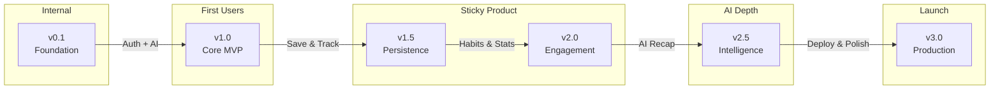

# LearnHub AI — Product Version Roadmap & Engineering Standards

> Designed by a Principal Software Architect perspective. Every version is independently stable, deployable, and delivers meaningful user value.

---

## 📜 Core Execution Principles

Every phase, feature, and line of code built for LearnHub AI must strictly obey these **10 Non-Negotiable Engineering Principles**:

1. **Build one feature completely before starting another.** Finish full integration (UI + API + DB + verification) before starting a new feature.
2. **Every feature must be deployable.** Never commit broken or half-integrated code.
3. **Never leave partially implemented functionality on the main branch.** Every commit represents a clean, functional state.
4. **Reuse components whenever possible.** Leverage existing design system primitives (`Button`, `Input`, `Card`, `Skeleton`, `Modal`, `EmptyState`) to maintain consistency and reduce bloat.
5. **AI responses must always be validated before persistence.** Use strict Zod schema validation on all Gemini AI outputs before writing to database or returning to UI.
6. **Prefer simplicity over cleverness.** Write readable, maintainable, straightforward code.
7. **Minimize dependencies unless they provide clear value.** Rely on established, lightweight tools without bloat.
8. **Preserve UI consistency across all pages.** Strictly follow design tokens (MP072 palette), typography, flat card patterns, and micro-interactions globally.
9. **Avoid refactoring unless it provides measurable benefits.** Resist premature abstraction; only refactor when concrete performance, security, or maintainability requirements demand it.
10. **Every version should be usable by real users.** Each milestone delivers a complete, non-broken, production-grade slice of functionality.

---

## 🎨 UI/UX Specification — Warm Flat 2.0

> **Source:** User-provided color palette (MP072) and LearnHub AI logo branding sheet.
> **Design Philosophy:** **Warm Flat 2.0.** An appealing, tactile evolution of flat design that avoids sterile flatness without introducing complex glassmorphism. Features layered warm surfaces, crisp subtle borders, warm ambient drop-shadows, and smooth, purposeful micro-animations.

### Color Palette — MP072

| Name | Hex | Role | Usage |
|---|---|---|---|
| **Abyssal Anchorfish Blue** | `#1B2632` | Background (darkest) | App canvas background, primary dark canvas |
| **Blue Fantastic** | `#2C3B4D` | Surface / Cards | Primary card backgrounds, elevated containers, input fields, navbar |
| **Oatmeal** | `#C9C1B1` | Secondary text / Borders | Muted text, subtle structural borders, placeholders, inactive icons |
| **Palladian** | `#EEE9DF` | Primary text | Headings, body text, primary labels — crisp contrast on dark surface |
| **Burning Flame** | `#FFB162` | Primary accent | Primary CTA buttons, active tab indicators, progress bars, streak flame |
| **Truffle Trouble** | `#A35139` | Secondary accent / Danger | Destructive actions, error badges, warm tag highlights |

#### CSS Variable Mapping (Warm Flat 2.0 Tokens)

```css
:root {
  /* Background Canvas & Layered Surfaces */
  --color-bg: #1B2632;
  --color-surface: #2C3B4D;
  --color-elevated: #35475c;          /* Slightly lighter warm navy for hover/elevation */
  --color-overlay: #151e28;           /* Darker backdrop for modals */

  /* Text & Readability */
  --color-text: #EEE9DF;
  --color-text-secondary: #C9C1B1;
  --color-text-muted: #8d8577;        /* Muted oatmeal for placeholders */

  /* Accents & Brand Warmth */
  --color-primary: #FFB162;           /* Burning Flame — CTAs, active highlights */
  --color-primary-hover: #ffc285;     /* Warm lighter flame */
  --color-primary-muted: rgba(255, 177, 98, 0.12); /* Soft warm highlight bg */
  --color-secondary: #A35139;         /* Truffle Trouble — earthy secondary */
  --color-secondary-hover: #b86047;
  --color-success: #4ade80;
  --color-danger: #A35139;

  /* Crisp Borders — Warm Flat 2.0 */
  --color-border: rgba(238, 233, 223, 0.09);   /* Subtle Palladian border */
  --color-border-hover: rgba(255, 177, 98, 0.35); /* Warm flame glow on hover */

  /* Warm Layered Shadows — Tactile Depth without Blur */
  --shadow-sm: 0 2px 4px rgba(15, 22, 30, 0.25);
  --shadow-md: 0 4px 12px rgba(15, 22, 30, 0.35);
  --shadow-lg: 0 8px 24px rgba(15, 22, 30, 0.45);
  --shadow-warm-glow: 0 0 16px rgba(255, 177, 98, 0.18);
}

/* Light Theme (Warm Canvas) */
[data-theme='light'] {
  --color-bg: #EEE9DF;
  --color-surface: #FFFFFF;
  --color-elevated: #f5efe6;
  --color-overlay: rgba(27, 38, 50, 0.5);
  --color-text: #1B2632;
  --color-text-secondary: #2C3B4D;
  --color-text-muted: #8a8278;
  --color-border: rgba(27, 38, 50, 0.09);
  --color-border-hover: rgba(255, 177, 98, 0.5);
  --shadow-sm: 0 2px 4px rgba(27, 38, 50, 0.06);
  --shadow-md: 0 4px 12px rgba(27, 38, 50, 0.09);
  --shadow-lg: 0 8px 24px rgba(27, 38, 50, 0.12);
}
```

### Logo & Branding Lockups

| Lockup | Variant | Application |
|---|---|---|
| **Icon Only** | Isometric stacked books vector | Favicon (16×16), mobile header, collapsed sidebar |
| **Horizontal Lockup** | Icon + "LEARNHUB AI" wordmark | Main Navbar, expanded desktop sidebar |
| **Stacked Lockup** | Centered Icon over wordmark | Landing page hero header, sign-in screen header |
| **App Icon** | Teal/blue rounded tile | Web app manifest icon |

---

### Card & Surface Specification — Warm Flat 2.0

```
┌─────────────────────────────────────────────────────────┐
│  Warm Flat 2.0 Surface Architecture:                    │
│                                                         │
│  • Solid Surface: var(--color-surface) [#2C3B4D]        │
│  • Crisp Border: 1px solid var(--color-border)          │
│  • Radius: 10px (consistent across all cards)          │
│  • Shadow: Soft warm ambient drop-shadow               │
│  • NO backdrop-filter / NO glass blur                   │
│                                                         │
│  Hover Micro-Interactions:                              │
│  - Translate: translateY(-2px)                          │
│  - Border Highlight: transitions to Burning Flame muted │
│  - Shadow: lifts slightly with soft warm glow           │
│  - Duration: 200ms ease-out cubic-bezier                │
└─────────────────────────────────────────────────────────┘
```

---

### ✨ Tasteful & Minimal Micro-Animations Framework

Animation should be **felt, not noticed**. All animations are fast (180ms – 250ms) and serve functional UX purposes:

1. **Page & Route Transitions (Framer Motion)**:
   - Fade in + subtle 8px slide-up: `{ opacity: [0, 1], y: [8, 0] }`, duration: `0.22s`, ease: `"easeOut"`.
   - Prevents abrupt page cuts while keeping navigation snappy.

2. **Staggered Content Reveals**:
   - Search results grid (Notes, Videos, Certs): Container uses `staggerChildren: 0.04s`. Cards pop in smoothly one after another.

3. **Button & Interactive Tap Feedback**:
   - Active press scale down: `whileTap={{ scale: 0.98 }}` for buttons and tab triggers.
   - Smooth hover state transitions (`180ms ease`) for background tint and border color.

4. **Milestone Checkbox & Progress Ring**:
   - Checkbox checkmark uses SVG path draw animation (`pathLength: 1`, duration `0.2s`).
   - Circular progress ring on Dashboard/Pathways uses SVG `stroke-dashoffset` CSS transition (`0.4s ease-in-out`).

5. **Warm Skeleton Shimmer**:
   - Pulse shimmer placeholder for loading states: Linear gradient shimmer from `#2C3B4D` to `#35475c` (1.5s loop).

---

### Typography

| Role | Font Family | Weights | Usage |
|---|---|---|---|
| Headings | **Space Grotesk** | 600 (semibold), 700 (bold) | Page titles, card headers, section titles |
| Body | **Inter** | 400 (regular), 500 (medium), 600 (semibold) | Descriptions, note text, milestone items, labels |

---

### Essential UI/UX Rules

1. **Warm Flat 2.0 surface hierarchy.** Solid layered navy surfaces with crisp 1px borders and soft warm drop-shadows. **Zero glassmorphism, zero blur effects.**
2. **Color fidelity.** Exclusively use the MP072 palette (`#1B2632`, `#2C3B4D`, `#C9C1B1`, `#EEE9DF`, `#FFB162`, `#A35139`).
3. **Warm accent highlight.** Burning Flame (`#FFB162`) drives all primary CTAs, active states, active tab indicators, and progress rings.
4. **Purposeful micro-animations.** 200ms transitions, subtle 2px hover lifts, staggered grid reveals, and smooth progress transitions.
5. **No distracting clutter.** Zero pop-ups, zero marketing badges, zero unwanted tags, zero complex multi-step wizards.
6. **Generous, balanced spacing.** Card padding: `20px` desktop / `16px` mobile. Grid gaps: `16px`–`20px`.
7. **Mobile responsiveness.** Collapsible desktop sidebar, fixed bottom navigation bar on mobile (<768px). Touch targets ≥44px.
8. **Dark mode first.** Warm dark canvas as default; clean light canvas available via toggle.

---

## Roadmap Overview



| Version | Codename | Purpose | Deployable? |
|---|---|---|---|
| **v0.1** | Foundation | Skeleton — project structure, design system, layout shell | ❌ Internal milestone |
| **v1.0** | Core MVP | First usable product — Auth + AI Search | ✅ Private beta |
| **v1.5** | Persistence | Save & revisit — Vault + Pathways | ✅ Closed beta |
| **v2.0** | Engagement | Habit building — Bookmarks, Streaks, Pulse | ✅ Open beta |
| **v2.5** | Intelligence | Deeper AI — Weekly Recap | ✅ Pre-launch |
| **v3.0** | Production | Launch-ready — deploy, polish, harden | ✅ **Public launch** |

---

## Version Definitions

---

### 🏗️ v0.1 — Foundation

**Primary Objective:** Establish the complete technical skeleton so that all future versions can be built without revisiting infrastructure decisions.

#### Features Included

| # | Feature | Scope |
|---|---|---|
| 1 | Vite + React 19 project scaffold | Client |
| 2 | Node.js + Express project scaffold | Server |
| 3 | CSS design system (MP072 palette tokens, dark/light themes, flat card styles) | Client |
| 4 | Dark/light theme toggle with localStorage persistence | Client |
| 5 | Common UI primitives (Button, Input, Card, Badge, Skeleton, EmptyState, ConfirmModal, Loader, ErrorBoundary) | Client |
| 6 | App layout shell (Sidebar, Navbar, BottomBar, PageWrapper, AppLayout) | Client |
| 7 | Express middleware stack (CORS, JSON parser, Morgan, rate limiter, global error handler) | Server |
| 8 | Zod environment validation (crash-on-missing-key) | Server |
| 9 | Supabase client initialization (server) | Server |
| 10 | Gemini 3.6 Pro + Flash client initialization | Server |
| 11 | YouTube Data API client initialization | Server |
| 12 | Standardized API response utilities (`apiSuccess`, `apiError`) | Server |
| 13 | Health check endpoint (`GET /api/health`) | Server |
| 14 | ESLint + Prettier configuration (both projects) | Tooling |
| 15 | `.env.example` files and `.gitignore` | Tooling |

#### Why These Features Belong Together

These are **zero-user-facing, zero-business-logic** components. They represent the architectural foundation upon which every feature is built. Grouping them ensures:
- No infrastructure decisions leak into feature development.
- Every config file, middleware, and design token is established once and reused forever.
- The layout shell is validated before any real page content is built inside it.
- Both client and server can be started locally and verified as running before any feature work begins.

#### Dependencies from Previous Versions

None — this is the root.

#### Expected User Experience

**None.** This is an internal engineering milestone. Navigating to the app shows the layout skeleton with placeholder page content ("Dashboard Content", "Explore Content", etc.). The server responds to health checks. No user-facing functionality exists.

#### Development Complexity

| Dimension | Rating |
|---|---|
| Effort | 🟢 Low-Medium |
| Risk | 🟢 Low |
| Decision Density | 🟡 Medium (design token choices, folder structure) |
| Estimated Time | 3–4 hours |

#### Testing Checklist Before Moving to v1.0

- [ ] `npm run dev` starts the Vite dev server without errors
- [ ] `npm run dev` starts the Express server without errors (with valid `.env`)
- [ ] Server crashes with clear message if any env var is missing
- [ ] `GET /api/health` returns `{ status: 'ok' }`
- [ ] Dark/light theme toggle works and persists across page reloads
- [ ] Sidebar collapses/expands, nav links highlight on active route
- [ ] Mobile bottom bar appears below 768px, sidebar hides
- [ ] All common components render without errors (manual visual check)
- [ ] ESLint passes with zero errors on both client and server
- [ ] `.env.example` documents all required variables

---

### 🚀 v1.0 — Core MVP

**Primary Objective:** Deliver the first product a user can meaningfully interact with — sign up, log in, search any topic, and receive AI-generated learning content.

> [!IMPORTANT]
> This is the **first version that delivers real user value**. A user can go from zero to receiving personalized study notes, video recommendations, certification suggestions, and a learning roadmap — all from a single search query.

#### Features Included

| # | Feature | Scope |
|---|---|---|
| 1 | **Gateway — Email Authentication** (register, login, logout) | Client + Server |
| 2 | **Gateway — OAuth** (Google + GitHub login) | Client + Supabase |
| 3 | Supabase Auth client (frontend) | Client |
| 4 | Axios API client with JWT bearer token interceptor | Client |
| 5 | Zustand auth store (session management, onAuthStateChange) | Client |
| 6 | Protected route guard component | Client |
| 7 | Auth sync endpoint (`POST /api/auth/sync` — profile upsert) | Server |
| 8 | Landing page (public — hero, CTA) | Client |
| 9 | Login + Register pages with OAuth buttons | Client |
| 10 | **Explore — AI Search** (the heart of the product) | Client + Server |
| 11 | AI prompt templates (notes, roadmap, certifications) | Server |
| 12 | `ai.service.js` — Gemini 3.6 Pro integration with structured JSON output | Server |
| 13 | `youtube.service.js` — YouTube Data API video search | Server |
| 14 | `explore.controller.js` — parallel `Promise.allSettled()` orchestration | Server |
| 15 | Explore page — search bar + 4 tabbed results (Notes, Videos, Certs, Pathway) | Client |
| 16 | Markdown note rendering (React Markdown + rehype-highlight) | Client |
| 17 | YouTube video cards with thumbnails | Client |
| 18 | Certification suggestion cards with provider/cost/difficulty | Client |
| 19 | 3-tier roadmap preview (Sprint / Stride / Marathon) | Client |
| 20 | Supabase DB tables: `profiles`, `searches` | Database |
| 21 | Row Level Security policies on `profiles` and `searches` | Database |

#### Why These Features Belong Together

**Auth and Explore are inseparable for the MVP** because:
- Explore requires authenticated API calls (Gemini costs money — every request must be tied to a user).
- The `searches` table requires a `user_id` foreign key.
- Without auth, there's no concept of "a user" — and without Explore, auth is pointless.
- Together they form the **minimum viable loop**: Sign up → Search → Get value.

Auth and Explore are the product's **core promise** — "AI-powered learning content for any topic." Everything else (saving, tracking, engagement) is an enhancement to this core loop.

#### Dependencies from Previous Versions

| Dependency | From |
|---|---|
| Layout shell (Sidebar, AppLayout, PageWrapper) | v0.1 |
| Common UI components (Button, Input, Card, Skeleton, etc.) | v0.1 |
| Design system (CSS variables, themes) | v0.1 |
| Server middleware stack (CORS, rate limiter, error handler) | v0.1 |
| Gemini + YouTube + Supabase client configs | v0.1 |

#### Expected User Experience

```
User visits LearnHub AI → Sees landing page → Clicks "Get Started"
  → Registers with email OR clicks "Continue with Google/GitHub"
  → Redirected to Dashboard (empty for now)
  → Navigates to Explore → Types "Machine Learning"
  → Sees loading skeletons → Results appear in 4 tabs:
      📝 Notes: Rich markdown study notes
      🎬 Videos: 8 relevant YouTube tutorials
      🏆 Certs: 5-8 certification suggestions
      🗺️ Pathway: 3-tier roadmap preview
  → User reads, browses, learns — but CANNOT save anything yet
  → User can log out and log back in
```

> [!NOTE]
> The intentional limitation of v1.0 is that **content is ephemeral** — users cannot save notes, bookmarks, or roadmaps. This creates natural demand for v1.5 (Persistence), validates the core AI experience first, and keeps scope tight.

#### Development Complexity

| Dimension | Rating |
|---|---|
| Effort | 🟡 Medium-High |
| Risk | 🟡 Medium (OAuth config, Gemini prompt quality, YouTube quota) |
| Decision Density | 🟡 Medium (prompt engineering, UI tab layout) |
| Estimated Time | 5–6 hours |

#### Testing Checklist Before Moving to v1.5

- [ ] Email registration creates user + profile row in Supabase
- [ ] Email login returns valid session, token persists on refresh
- [ ] Google OAuth completes full flow and lands on dashboard
- [ ] GitHub OAuth completes full flow and lands on dashboard
- [ ] Logout clears session and redirects to landing
- [ ] Unauthenticated access to `/explore` redirects to `/login`
- [ ] Searching a topic returns results in all 4 tabs
- [ ] Notes tab renders markdown with proper headings and code blocks
- [ ] Videos tab displays thumbnails, titles, and channel names
- [ ] Certifications tab shows provider, cost, and difficulty badges
- [ ] Pathway tab displays 3 tiers with milestone previews
- [ ] Searching with empty input shows validation error
- [ ] Rate limiter blocks excessive explore requests (>10/min)
- [ ] RLS verified: User A's searches are invisible to User B
- [ ] Works on mobile (responsive layout, bottom bar navigation)

---

### 💾 v1.5 — Persistence

**Primary Objective:** Transform LearnHub AI from a disposable search tool into a **personal knowledge system** where users can save, organize, and revisit their learning content.

#### Features Included

| # | Feature | Scope |
|---|---|---|
| 1 | **Vault — Save Notes** from Explore to personal vault | Client + Server |
| 2 | Vault page — browse, search, pin, delete saved notes | Client |
| 3 | Full note viewer with markdown rendering | Client |
| 4 | Pin/unpin notes (pinned notes float to top) | Client + Server |
| 5 | Delete note with confirmation modal | Client + Server |
| 6 | Notes CRUD API (`GET`, `POST`, `DELETE`, `PATCH /pin`) | Server |
| 7 | **Pathways — Save Roadmap** from Explore with tier selection | Client + Server |
| 8 | Pathways list page — all saved roadmaps with progress rings | Client |
| 9 | PathwayView page — vertical timeline with milestone cards | Client |
| 10 | Milestone check-off toggle (mark as completed) | Client + Server |
| 11 | Auto-calculated progress percentage per roadmap | Server |
| 12 | Roadmap + Milestones CRUD API | Server |
| 13 | Supabase DB tables: `notes`, `roadmaps`, `milestones` | Database |
| 14 | RLS policies on `notes`, `roadmaps`, `milestones` | Database |
| 15 | Toast notifications on save/delete/pin actions | Client |

#### Why These Features Belong Together

Vault and Pathways are **two sides of the same coin** — they both answer the question *"What happens after I search?"*:
- Vault answers: *"I want to keep these notes for later."*
- Pathways answers: *"I want to follow this roadmap step by step."*

Shipping them together creates the **complete learning lifecycle**:
```
Search → Discover → Save → Revisit → Follow → Track Progress
```

Separating them would create an awkward half-product where users can save notes but not roadmaps (or vice versa). Together, they transform the app from a **search tool** into a **learning companion**.

#### Dependencies from Previous Versions

| Dependency | From |
|---|---|
| Explore search flow (generates notes + roadmap content) | v1.0 |
| Auth system (user_id for all saved content) | v1.0 |
| Common components (Card, EmptyState, ConfirmModal, Skeleton) | v0.1 |
| Toast notifications (react-hot-toast, already wired in App.jsx) | v0.1 |

#### Expected User Experience

```
User searches "React" → Notes tab → Clicks "Save to Vault" → Toast: "Note saved ✓"
  → Navigates to Vault → Sees saved note card → Pins it → Views full markdown
  → Searches again → Pathway tab → Selects "Stride" tier → Clicks "Save Pathway"
  → Navigates to Pathways → Sees roadmap card with 0% progress
  → Opens roadmap → Vertical timeline with milestone cards
  → Checks off "Understanding JSX" → Progress ring: 12%
  → Checks off 3 more → Progress ring: 48%
  → Returns to Pathways list → Progress visible on card
```

#### Development Complexity

| Dimension | Rating |
|---|---|
| Effort | 🟡 Medium |
| Risk | 🟢 Low (straightforward CRUD, well-defined data models) |
| Decision Density | 🟢 Low (clear UX patterns — list, detail, toggle) |
| Estimated Time | 3–4 hours |

#### Testing Checklist Before Moving to v2.0

- [ ] "Save to Vault" from Explore creates note in database and shows toast
- [ ] Vault page lists all user's notes, newest first
- [ ] Search filter in Vault filters notes by topic/title
- [ ] Pinning a note moves it to the top of the list
- [ ] Deleting a note shows confirmation modal, then removes it with toast
- [ ] Full note viewer renders markdown with syntax highlighting
- [ ] "Save Pathway" from Explore creates roadmap + milestones in database
- [ ] Pathways page lists all roadmaps with tier badges and progress rings
- [ ] Opening a roadmap shows vertical timeline with all milestones
- [ ] Toggling a milestone updates completion state and recalculates progress %
- [ ] Multiple roadmaps for different topics can coexist
- [ ] Empty states display correctly when Vault/Pathways have no items
- [ ] RLS verified: users cannot access other users' notes or roadmaps

---

### 🔥 v2.0 — Engagement

**Primary Objective:** Transform one-time users into **habitual learners** by adding retention mechanics — bookmarking, streak tracking, and a progress dashboard.

#### Features Included

| # | Feature | Scope |
|---|---|---|
| 1 | **Bookmarks** — save videos, certifications, or notes from anywhere | Client + Server |
| 2 | Bookmark button on video cards, cert cards, and note cards | Client |
| 3 | Bookmarks page with type filter tabs (All / Videos / Certs / Notes) | Client |
| 4 | Bookmarks CRUD API | Server |
| 5 | **Streaks** — daily learning activity tracking | Client + Server |
| 6 | Activity logging on search, note save, milestone completion | Server |
| 7 | Current streak + longest streak calculation | Server |
| 8 | GitHub-style streak contribution calendar (last 90 days) | Client |
| 9 | **Pulse Dashboard** — aggregate learning statistics | Client |
| 10 | Stats grid: Active Pathways, Notes Collected, Topics Explored, Completion Rate | Client |
| 11 | Progress chart (Recharts) — visual breakdown of roadmap progress | Client |
| 12 | Streak calendar widget on dashboard | Client |
| 13 | Supabase DB tables: `bookmarks`, `streak_log` | Database |
| 14 | RLS policies on `bookmarks` and `streak_log` | Database |
| 15 | Profile fields: `current_streak`, `longest_streak`, `last_active_date` | Database |

#### Why These Features Belong Together

Bookmarks, Streaks, and Pulse are all **engagement and retention features** that share a common architectural pattern — they track user behavior and surface it back as motivation:

- **Bookmarks** reduce friction: *"I'll save this for later"* (lower commitment than saving full notes).
- **Streaks** create habit loops: *"I've been learning 7 days straight — can't break it now."*
- **Pulse** provides feedback: *"Here's everything you've accomplished."*

None of these features require changes to the core search or persistence layers. They are **additive** — they read from existing data (searches, notes, milestones) and add lightweight tracking on top. This makes them a natural "engagement layer" that can ship as a cohesive upgrade.

#### Dependencies from Previous Versions

| Dependency | From |
|---|---|
| Auth system (user identification) | v1.0 |
| Explore (generates bookmarkable content — videos, certs) | v1.0 |
| Vault (bookmarkable notes, note count for Pulse) | v1.5 |
| Pathways (progress data for Pulse dashboard, milestone events for streaks) | v1.5 |

#### Expected User Experience

```
User searches "Python" → Videos tab → Clicks ⭐ on a video → Toast: "Bookmark added ✓"
  → Certs tab → Bookmarks a free certification
  → Navigates to Bookmarks → Filters by "Videos" → Sees saved video
  → Navigates to Dashboard (Pulse) → Sees:
      📊 3 Active Pathways | 12 Notes | 8 Topics | 67% Completion Rate
      📈 Progress chart showing roadmap completion breakdown
      🔥 7-day streak! Calendar shows green squares for active days
  → User feels motivated to continue learning tomorrow
```

#### Development Complexity

| Dimension | Rating |
|---|---|
| Effort | 🟡 Medium |
| Risk | 🟢 Low-Medium (streak logic edge cases around day boundaries/timezones) |
| Decision Density | 🟢 Low (well-known UX patterns — bookmarks, calendars, dashboards) |
| Estimated Time | 3–4 hours |

#### Testing Checklist Before Moving to v2.5

- [ ] Bookmark button appears on video, cert, and note cards
- [ ] Bookmarking shows toast, un-bookmarking removes it
- [ ] Bookmarks page lists all bookmarks with correct type badges
- [ ] Type filter tabs work correctly (All / Videos / Certs / Notes)
- [ ] Searching a topic increments the streak for today
- [ ] Saving a note increments the streak for today
- [ ] Completing a milestone increments the streak for today
- [ ] Multiple activities on the same day count as one streak day
- [ ] Streak resets to 0 if a day is missed
- [ ] Longest streak updates when current streak exceeds it
- [ ] Streak calendar renders last 90 days with activity heatmap
- [ ] Dashboard stats are accurate (count notes, pathways, topics, completion %)
- [ ] Progress chart accurately reflects roadmap data
- [ ] Dashboard loads within 2 seconds
- [ ] RLS verified on bookmarks and streak_log tables

---

### 🧠 v2.5 — Intelligence

**Primary Objective:** Deepen the AI integration beyond search — the platform now **reflects on user behavior** and provides personalized weekly learning summaries.

#### Features Included

| # | Feature | Scope |
|---|---|---|
| 1 | **Recap** — AI-generated weekly learning summary | Client + Server |
| 2 | Recap prompt template (`recap.prompt.js`) | Server |
| 3 | Recap service using **Gemini 3.6 Flash** (lightweight model) | Server |
| 4 | Recap generation trigger (on dashboard load if >7 days since last, or manual button) | Client + Server |
| 5 | RecapCard component on Dashboard | Client |
| 6 | Past recaps list (view previous weeks) | Client |
| 7 | Recap API (`POST /api/recap/generate`, `GET /api/recap`) | Server |
| 8 | Supabase DB table: `recaps` | Database |
| 9 | RLS policy on `recaps` | Database |

#### Why This is a Separate Version

Recap is architecturally distinct from the rest of the engagement features because:

1. **Different AI model** — It uses Gemini 3.6 Flash (not Pro), requiring a separate service path.
2. **Different data flow** — It *reads* from multiple tables (searches, notes, milestones, streak_log) and *synthesizes* a summary. This is a fundamentally different pattern from the write-oriented engagement features.
3. **Temporal logic** — It introduces time-windowed queries (last 7 days) and scheduled generation, which is a new concern.
4. **No email/notifications** — The user explicitly requested this be website-only, so it's a dashboard card, not a background job.

Isolating Recap ensures the engagement layer (v2.0) ships cleanly without this additional complexity. It also allows prompt engineering and AI quality tuning to happen independently.

#### Dependencies from Previous Versions

| Dependency | From |
|---|---|
| Auth system | v1.0 |
| Searches data (topics explored) | v1.0 |
| Notes data (notes saved count) | v1.5 |
| Milestones data (milestones completed) | v1.5 |
| Streak data (streak count, active days) | v2.0 |
| Pulse Dashboard (RecapCard is placed here) | v2.0 |

#### Expected User Experience

```
User opens Dashboard → RecapCard says "Your weekly recap is ready!"
  → Card displays:
      📋 "Your Week in Review (Jul 24 – Jul 30)"
      🔍 3 topics explored
      📝 5 notes saved
      ✅ 8 milestones completed
      🔥 7-day streak!
      💡 "Great progress on React! Consider diving into
          state management next."
      → Suggested Next Steps: Continue React Stride (65%),
        Explore "Node.js"
  → User clicks "Previous Recaps" → Scrolls through past summaries
  → User clicks "Generate New Recap" → Fresh summary generated
```

#### Development Complexity

| Dimension | Rating |
|---|---|
| Effort | 🟢 Low-Medium |
| Risk | 🟢 Low (lightweight generation, simple UI) |
| Decision Density | 🟢 Low (single component, single API) |
| Estimated Time | 1.5–2 hours |

#### Testing Checklist Before Moving to v3.0

- [ ] Recap auto-generates on dashboard load when last recap is >7 days old
- [ ] Recap does NOT auto-generate if a recent recap exists
- [ ] Manual "Generate Recap" button works
- [ ] RecapCard displays accurate stats from last 7 days
- [ ] AI-generated summary is relevant and personalized
- [ ] Past recaps are listable and viewable
- [ ] Recap works correctly for new users with minimal activity
- [ ] Recap handles edge case: user with zero activity in the last 7 days
- [ ] Gemini Flash (not Pro) is used for recap generation
- [ ] RLS verified on recaps table

---

### 🌍 v3.0 — Production

**Primary Objective:** Transform the development build into a **production-grade, publicly deployable application** with security hardening, performance optimization, and deployment infrastructure.

#### Features Included

| # | Feature | Scope |
|---|---|---|
| 1 | **404 page** — friendly not-found with navigation | Client |
| 2 | Comprehensive error boundaries on all route segments | Client |
| 3 | **Framer Motion** page transitions and card stagger animations | Client |
| 4 | Skeleton loaders on every data-fetching page | Client |
| 5 | **Favicon** + Open Graph meta tags + SEO meta descriptions | Client |
| 6 | **Responsive audit** — verify all pages at 375px, 768px, 1280px | Client |
| 7 | **Accessibility audit** — Tab order, ARIA labels, focus rings, 4.5:1 contrast | Client |
| 8 | **Focus management** — modal focus trapping, return focus on close | Client |
| 9 | Touch target sizing (≥44px on mobile) | Client |
| 10 | `README.md` with architecture overview, setup guide, screenshots | Tooling |
| 11 | Production environment configuration | Server |
| 12 | CORS hardening for production domain | Server |
| 13 | **Deploy frontend → Vercel** | Infrastructure |
| 14 | **Deploy backend → Render** (with health check) | Infrastructure |
| 15 | Production OAuth redirect URL configuration in Supabase | Infrastructure |
| 16 | HTTPS verification on both domains | Infrastructure |
| 17 | End-to-end QA testing on production | QA |

#### Why These Features Belong Together

These are all **non-functional requirements** that don't add new user features but are **mandatory for a production release**:
- Animations and polish make the app feel premium.
- Accessibility and responsive design make it usable by everyone.
- Deployment and security make it safe to expose to the public internet.
- SEO and meta tags make it shareable and discoverable.

Bundling them into a final "hardening" release prevents polish work from slowing down feature development in earlier versions, while ensuring nothing ships to production without these quality gates.

#### Dependencies from Previous Versions

All features from v0.1 through v2.5 must be complete and stable.

#### Expected User Experience

```
User visits https://learnhub-ai.vercel.app → Premium landing page loads instantly
  → Smooth page transitions between routes
  → All interactions feel polished (toasts, skeletons, animations)
  → Works flawlessly on phone, tablet, and desktop
  → Keyboard-only navigation works throughout
  → Sharing the URL shows rich Open Graph preview
  → OAuth login works with production redirect URLs
  → The app feels like a finished, professional product
```

#### Development Complexity

| Dimension | Rating |
|---|---|
| Effort | 🟡 Medium |
| Risk | 🟡 Medium (deployment config, OAuth redirect URLs, CORS issues) |
| Decision Density | 🟢 Low (polish is systematic, not creative) |
| Estimated Time | 2–3 hours |

#### Testing Checklist (Pre-Launch)

- [ ] Full E2E flow on production: Register → Login (email + Google + GitHub) → Explore → Save → Track → Dashboard → Recap → Logout
- [ ] 5 diverse topics searched — AI output quality verified
- [ ] Mobile responsive at 375px, 768px, 1280px
- [ ] Keyboard-only full-app navigation
- [ ] Color contrast passes 4.5:1 on all text
- [ ] All modals trap focus and return focus on close
- [ ] OAuth flows complete successfully on production domain
- [ ] Rate limiting blocks rapid requests
- [ ] RLS across all tables — cross-user data access impossible
- [ ] Health check returns 200 on Render
- [ ] Page load time < 3 seconds on 3G throttle
- [ ] Open Graph preview renders correctly when URL is shared
- [ ] 404 page displayed for invalid routes

---

## 📊 Overall Development Timeline

> **Pace:** 7–8 hours per day × 3 days = 21–24 hours total.
> **UI Instructions:** Pending from user — will be incorporated before Day 1 execution begins.

```mermaid
gantt
    title LearnHub AI — 3-Day Version Timeline
    dateFormat HH:mm
    axisFormat %H:%M

    section Day 1 — Foundation & Core
    v0.1 Foundation           :v01, 00:00, 3h
    v0.1 Testing & Verify     :t01, after v01, 30m
    v1.0 Core MVP (Auth)      :v10a, after t01, 2h
    v1.0 Core MVP (Explore)   :v10b, after v10a, 2h

    section Day 2 — Persistence & Engagement
    v1.5 Vault                :v15a, 00:00, 2h
    v1.5 Pathways             :v15b, after v15a, 2h
    v1.5 Testing & Verify     :t15, after v15b, 30m
    v2.0 Bookmarks            :v20a, after t15, 1h
    v2.0 Streaks + Pulse      :v20b, after v20a, 2h

    section Day 3 — Intelligence, Polish & Launch
    v2.0 Testing & Verify     :t20, 00:00, 30m
    v2.5 Recap                :v25, after t20, 2h
    v3.0 Polish & A11y        :v30a, after v25, 2h
    v3.0 Deploy & QA          :v30b, after v30a, 3h
```



### Day 1 — Foundation & Core MVP (7–8 hrs)

| Block | Version | Focus | Time |
|---|---|---|---|
| 1 | v0.1 | Project scaffold, design system, layout shell, server configs + middleware | 3 hrs |
| 2 | v0.1 | **Verify:** Both dev servers run, health check responds, theme toggle works, layout renders | 30 min |
| 3 | v1.0 | Gateway — Email auth, Google + GitHub OAuth, auth store, protected routes, landing page | 2 hrs |
| 4 | v1.0 | Explore — AI prompts, Gemini integration, YouTube API, 4-tab search results UI | 2 hrs |
| — | v1.0 | **Verify:** Full auth flow, search returns results in all 4 tabs, RLS on profiles/searches | Buffer |

### Day 2 — Persistence & Engagement (7–8 hrs)

| Block | Version | Focus | Time |
|---|---|---|---|
| 5 | v1.5 | Vault — Notes CRUD API, save from Explore, browse/pin/delete, markdown viewer | 2 hrs |
| 6 | v1.5 | Pathways — Roadmap CRUD API, save from Explore, timeline view, milestone toggle, progress | 2 hrs |
| 7 | v1.5 | **Verify:** Save/view/pin/delete notes, save/track/complete roadmap milestones, RLS | 30 min |
| 8 | v2.0 | Bookmarks — CRUD API, bookmark buttons on cards, bookmarks page with type filters | 1 hr |
| 9 | v2.0 | Streaks — Activity logging, streak calculation, heatmap calendar + Pulse Dashboard stats | 2 hrs |

### Day 3 — Intelligence, Polish & Launch (7–8 hrs)

| Block | Version | Focus | Time |
|---|---|---|---|
| 10 | v2.0 | **Verify:** Bookmarks, streak logic, dashboard stats accuracy | 30 min |
| 11 | v2.5 | Recap — Gemini Flash prompt, recap API, RecapCard on dashboard, past recaps | 2 hrs |
| 12 | v3.0 | Polish — 404 page, Framer Motion animations, skeleton loaders, favicon + meta tags | 2 hrs |
| 13 | v3.0 | Deploy — Vercel (frontend), Render (backend), OAuth redirects, CORS, accessibility audit, full E2E QA | 3 hrs |

### Summary

| Version | Estimated Time | Day | End State |
|---|---|---|---|
| v0.1 Foundation | 3.5 hrs | Day 1 | Skeleton running, design system, layout shell |
| v1.0 Core MVP | 4 hrs | Day 1 | Auth + AI Search — first usable product |
| v1.5 Persistence | 4.5 hrs | Day 2 | Vault + Pathways — save & track learning |
| v2.0 Engagement | 3 hrs | Day 2 | Bookmarks + Streaks + Pulse Dashboard |
| v2.5 Intelligence | 2 hrs | Day 3 | Weekly AI Recap |
| v3.0 Production | 5 hrs | Day 3 | Deployed, polished, production-ready |
| **Total** | **~22 hrs** | **3 days** | **🚀 Public launch** |

**Total estimated development time: 21–24 hours across 3 days (7–8 hrs/day).**

---

## 📋 Recommended Implementation Order

| Priority | Version | Rationale |
|---|---|---|
| 1st | **v0.1 Foundation** | Everything depends on this. Zero risk of rework if done right. |
| 2nd | **v1.0 Core MVP** | Delivers the product's core value proposition. Validates AI integration early. |
| 3rd | **v1.5 Persistence** | Natural follow-up — users asked for saving. Straightforward CRUD. |
| 4th | **v2.0 Engagement** | Builds on existing data. Additive layer, no core changes. |
| 5th | **v2.5 Intelligence** | Requires engagement data to be meaningful. Small scope. |
| 6th | **v3.0 Production** | Final polish. Must be last — polishing a moving target is wasteful. |

> [!WARNING]
> **Do not skip or reorder versions.** Each version's database schema, API endpoints, and component architecture are designed to build on the previous version's foundation without refactoring.

---

## ⚠️ Risk Assessment

| Version | Risk Level | Primary Risks | Mitigation |
|---|---|---|---|
| **v0.1** | 🟢 Low | Wrong design token choices | Review with visual prototype before v1.0 |
| **v1.0** | 🟡 Medium | Gemini prompt quality produces poor notes/roadmaps | Iterate prompts in isolation before wiring UI. Have fallback error states. |
| **v1.0** | 🟡 Medium | OAuth redirect misconfiguration | Test OAuth in Supabase dashboard before building UI |
| **v1.0** | 🟢 Low | YouTube API quota exhaustion | Monitor usage. 10K units/day is generous for development. |
| **v1.5** | 🟢 Low | Data integrity on milestone progress calc | Unit-test progress calculation logic independently |
| **v2.0** | 🟡 Medium | Streak timezone edge cases | Use UTC server-side for all date calculations |
| **v2.0** | 🟢 Low | Dashboard performance with many data points | Paginate queries, limit streak calendar to 90 days |
| **v2.5** | 🟢 Low | Recap quality for users with minimal activity | Handle edge case explicitly in prompt: "If minimal activity, encourage exploration" |
| **v3.0** | 🟡 Medium | CORS/OAuth failures in production | Test with production URLs before final deployment |
| **v3.0** | 🟢 Low | Performance on slow networks | Verify with Chrome DevTools 3G throttle |

---

## 🚢 Deployment Points

| After Version | Deploy To | Purpose |
|---|---|---|
| v0.1 | ❌ No deployment | Internal milestone only |
| v1.0 | ✅ **Staging** (Vercel preview + Render free tier) | Private beta — share with 2-3 testers to validate AI output quality |
| v1.5 | ✅ **Staging update** | Closed beta — invite 5-10 users to test save/track flows |
| v2.0 | ✅ **Staging update** | Open beta — broader testing of engagement features |
| v2.5 | ✅ **Pre-production** | Near-final — validate recap AI quality with real user data |
| v3.0 | ✅ **Production launch** 🚀 | Public release — custom domain, production OAuth, full polish |

---

## 🔮 Long-Term Evolution Strategy

Beyond v3.0, LearnHub AI can evolve along these tracks:

| Version | Codename | Focus | Key Features |
|---|---|---|---|
| **v3.1** | Refinement | UX optimization | Search history, recent searches, note editing, roadmap customization |
| **v3.2** | Export | Content portability | Export notes as PDF, export roadmaps as shareable links |
| **v4.0** | Compass | Skill intelligence | AI skill-gap analyzer — input current skills, get gap analysis & personalized recommendations |
| **v4.1** | Spark | Daily learning | AI-curated daily micro-challenges and learning tips based on saved topics |
| **v4.5** | Focus Mode | Productivity | Pomodoro timer integrated into roadmap milestones for focused study sessions |
| **v5.0** | Community | Social learning | Share roadmaps/notes publicly, follow other learners, community boards |

### Evolution Principles
1. **v3.x releases** focus on **refinement** — making existing features better, not adding new ones.
2. **v4.x releases** deepen **AI intelligence** — the platform becomes smarter about the user's learning journey.
3. **v5.0** introduces **social features** — only after the individual learning experience is polished and validated.

> [!TIP]
> The architecture established in v0.1 (modular services, feature-based components, Zustand stores) is designed to accommodate all future versions without structural refactoring. New features slot into existing `components/features/`, `services/`, `controllers/`, and `routes/` directories.
